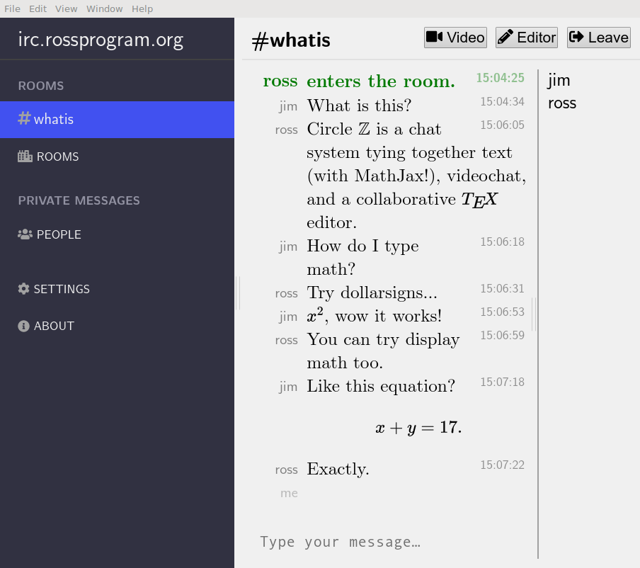

# What is Circle ℤ?

At its core, it is an IRC client, built upon code from [Kiwi
IRC](https://github.com/kiwiirc/irc-framework).

On top of that, we include quick access to videochat, built with
[Jitsi](https://github.com/jitsi) for video conferences.  Each "room"
(meaning an IRC channel) also gets its own collaborative TeX editor.

